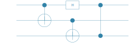
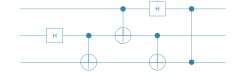

```julia
# install Yao/YaoPlots via 
#     using Pkg
#     Pkg.add("Yao")
#     Pkg.add("YaoPlots")

using Yao,YaoPlots
```

# create a maximally entangled Bell state


```julia
Φcircuit = chain(2, 
    put(1=>H), 
    control(1, 2=>X)
)
Φ = zero_state(2) |> Φcircuit
state(Φ)
```


    4×1 Matrix{ComplexF64}:
     0.7071067811865475 + 0.0im
                    0.0 + 0.0im
                    0.0 + 0.0im
     0.7071067811865475 + 0.0im


```julia
plot(Φcircuit)
```


# define the teleportation circuit


```julia
tele = chain(3,
    control(1, 2=>X),
    put(1=>H),
    control(2,3=>X),
    control(1,3=>Z),
)
plot(tele)
```





 total circuit


```julia
chain(3, put(2:3 => Φcircuit), tele) |> plot
```





# run teleportation


```julia
ψ = rand_state(1)
state(ψ)
```


    2×1 Matrix{ComplexF64}:
     -0.4190847132945371 + 0.665075241826809im
      0.5669440122932977 - 0.24620603712464928im


```julia
out = join(ψ,Φ) |> tele
state(out)
```


    8×1 Matrix{ComplexF64}:
     -0.419084713294537 + 0.6650752418268089im
                    0.0 + 0.0im
                    0.0 + 0.0im
                    0.0 + 0.0im
     0.5669440122932976 - 0.24620603712464922im
                   -0.0 - 0.0im
                   -0.0 + 0.0im
                   -0.0 - 0.0im


discard qubits 1,2


```julia
measure!(RemoveMeasured(), out, 1:2) 
state(out)
```


    2×1 Matrix{ComplexF64}:
     -0.4190847132945371 + 0.665075241826809im
      0.5669440122932977 - 0.24620603712464928im


```julia

```
